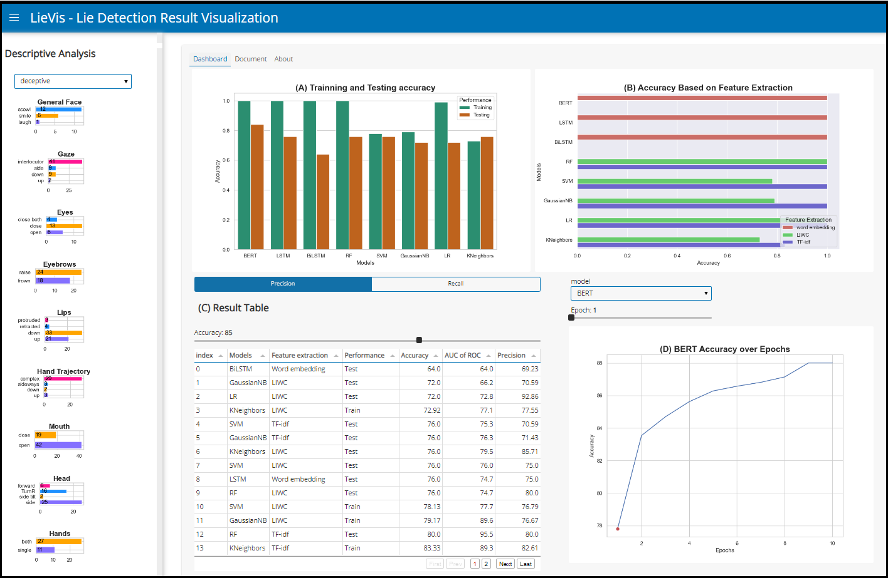

# LieVis: Visual Analytics for Discovering Intersectional Bias in Machine Learning

**LieVis** A Visual Interactive Dashboard for Lie Detection Using Machine Learning and Deep Learning Techniques.

* Try a **[live demo](https://khsakib.github.io/LieVis/)**!
* Read the **[full paper](ICWL_2023__UTS__Prome__LieVis.pdf)**.
* **[Cite this work and more](https://cabreraalex.com/#/paper/Lievis)**.

